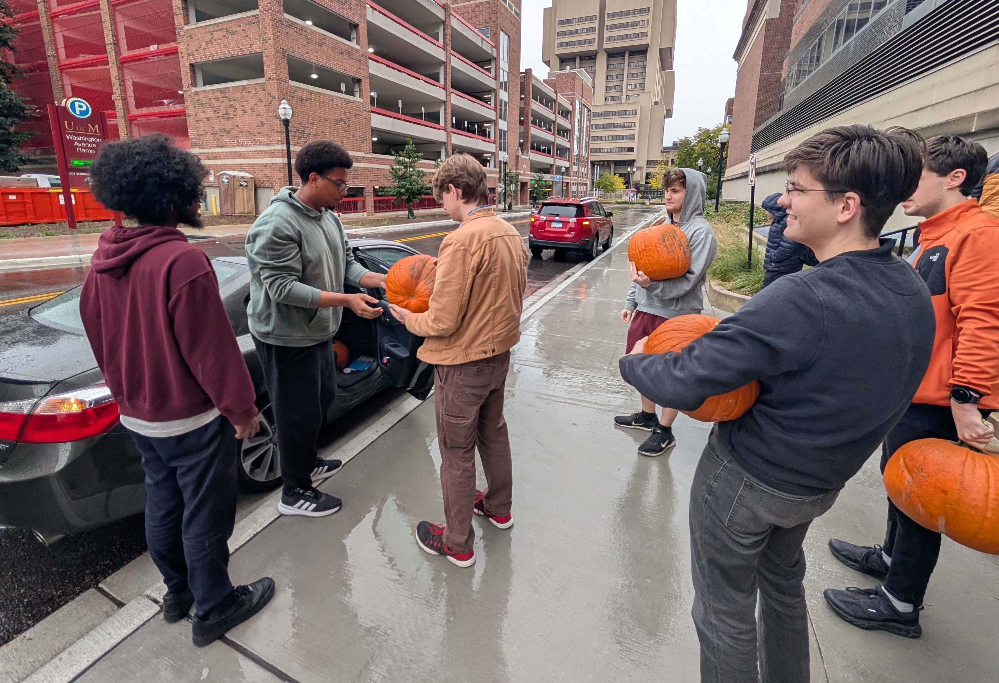
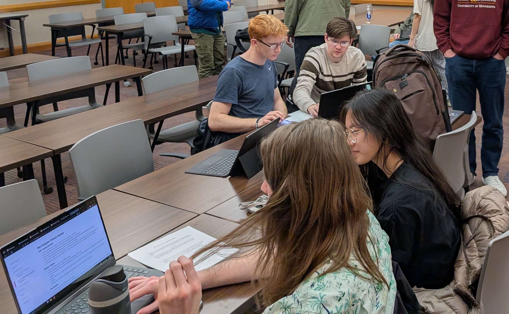
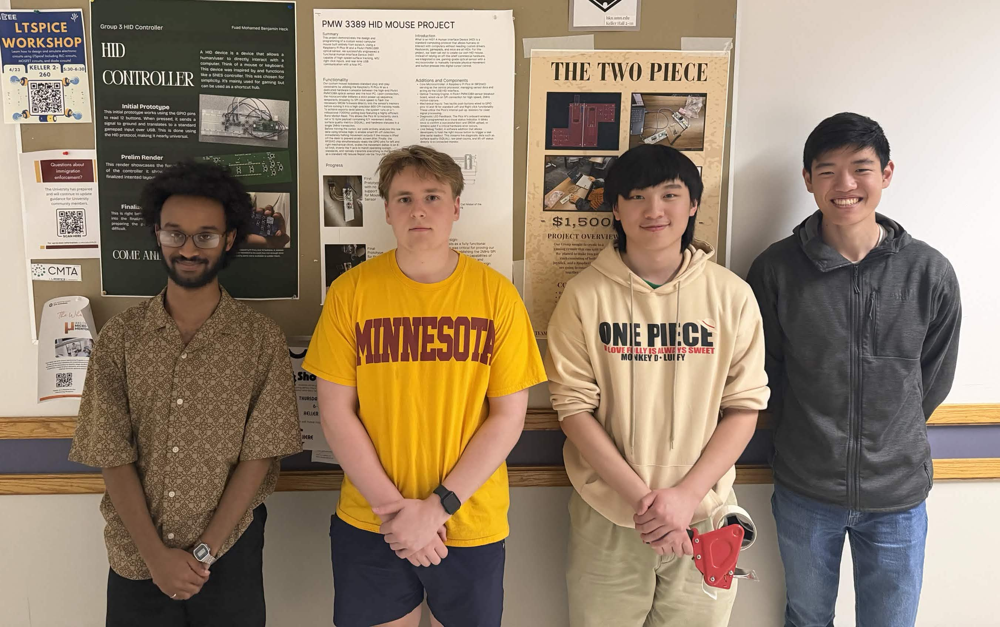

+++
# This file is used for describing the club structure in the About Us page.
+++

## Club Structure

Our events are open to everyone, but if you want to get even more involved with
the club, you can join our committees! Our committees meet immediately after our
weekly general meetings, and allow further involvement in the club for general
members.

### Event Committee

The Event Committee handles the logistics and helps plan for IEEE UMN events,
as well as social media and advertising. Members get to help create engaging
experiences for the community while gaining experience in event management,
graphic design, and marketing.

### Outreach (ROE) Committee

Reach Out ECE (ROE) is an initiative aimed to give freshmen and sophomores
experience in topics and software that can help them inside and outside of
the classroom. This is also an opportunity for upperclassmen to get relevant
experience in mentoring, and connecting underclassmen to resources.

### Tech Committee

The Tech Committee is a place for members who want to build and learn by doing.
This is a committee focused on building personal projects year-round, outside of
a strictly academic environment.

Members can work through guided projects centered around a shared prompt or
pursue their own independent ideas. Teams are supported with resources and
materials throughout the build process, while developing skills through hands-on
experience. No prior experience is required to join Tech Committee, just the
willingness to learn and build.

This year’s project focuses on building USB HID devices, such as keyboards,
controllers, or other custom input devices that connect to a computer.
Teams can choose their own approach, whether that means creating something
practical or exploring a new idea. Check out our projects on the [committee
mainframe](/projects)!

