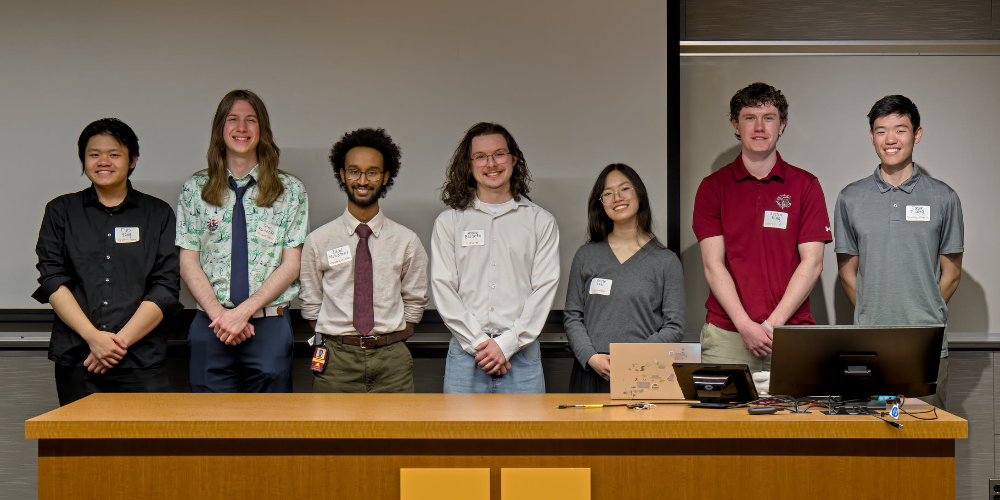

+++
# This file is used to describe the club structure in the About Us page.
+++

## Officers (Board Members)

Your fellow IEEE UMN officers work to create opportunities for the engineering
community! From technical workshops and social events to industry partnerships
and collaborations with other student organizations, we're committed to helping
members connect, grow, and succeed. We also work closely with faculty and
department leadership to advocate for student interests and needs.

We also offer "internship" opportunities throughout the year that allow members
to work alongside the IEEE UMN Board, gain leadership experience, and help plan
future events.

**2026-2027 Officers**

|                        |                |
| ---------------------- | -------------- |
| President              | Peter Reinecke |
| Vice President         | Fuad Mohamed   |
| Treasurer              | Ansley Braseth |
| Secretary              | Anne Tsai      |
| Outreach Coordinator   | Justin King    |
| Membership Coordinator | Jason Jiang    |
| Systems Administrator  | Ellis Yang     |
