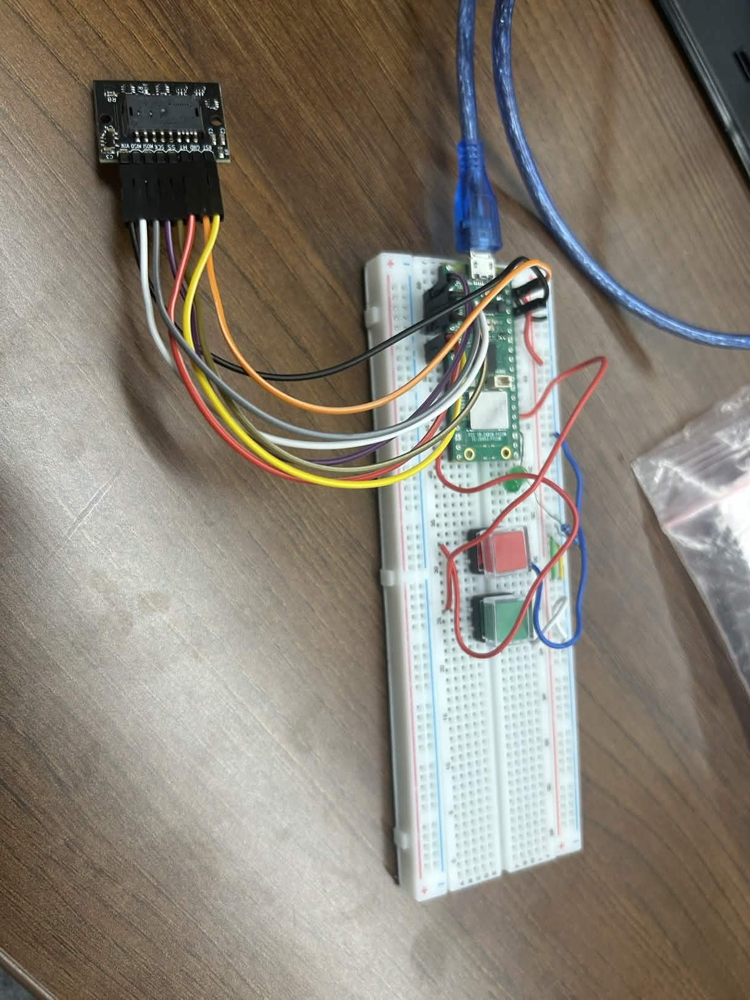
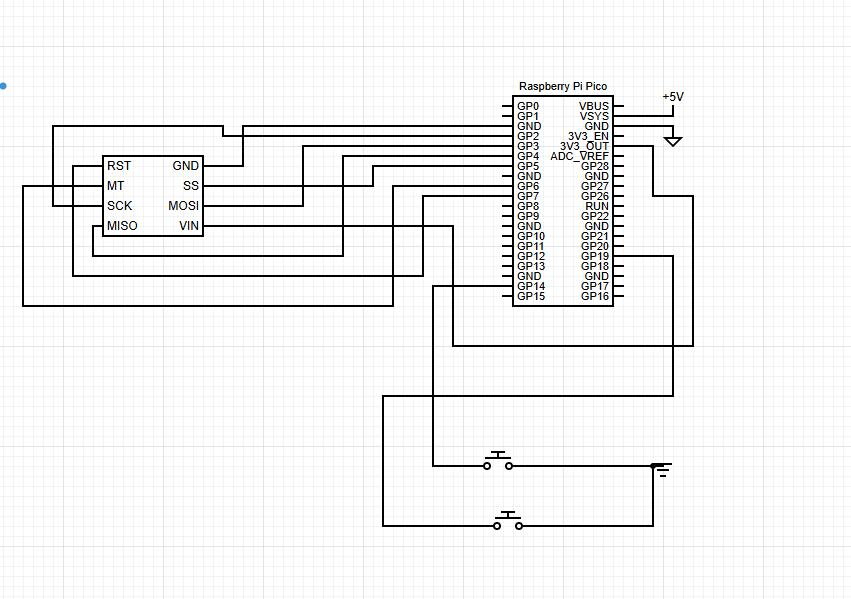
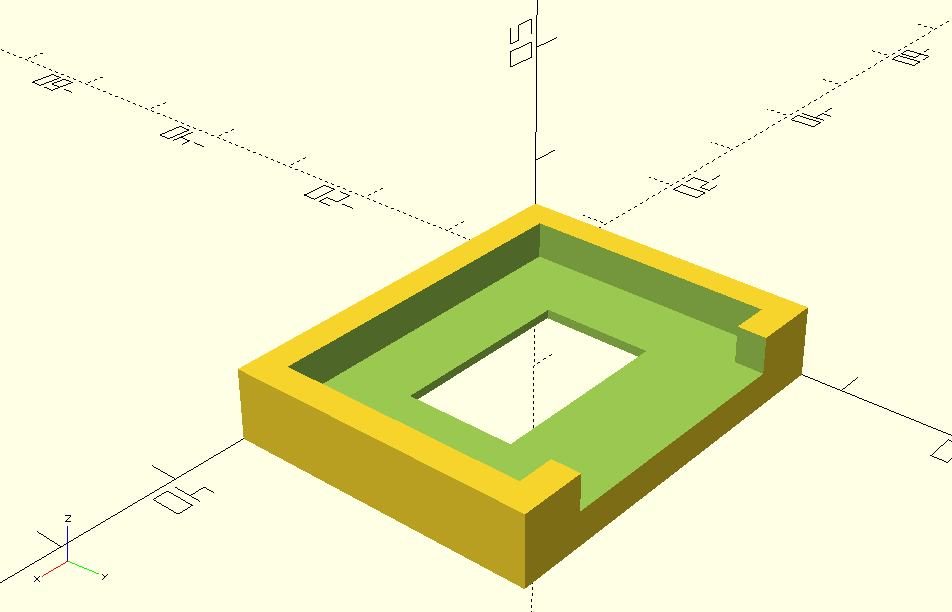

+++
title = "Optical Sensor Mouse"
+++

Team Matthew and Justin built a custom wired HID mouse using a Raspberry Pi
Pico W and a PixArt PMW3389 optical sensor. The goal was to create a functional
high-performance USB mouse that could track movement, handle left/right clicks,
and communicate with a computer using the HID protocol.

They successfully created a working breadboard prototype, established SPI
communication with the PMW3389 sensor, verified USB HID mouse reporting through
TinyUSB, and implemented cursor movement plus click inputs. They also tested
real-time sensor data, built a 3D-printed jig to support correct sensor height,
and began planning a final PCB and ergonomic mouse shell.

