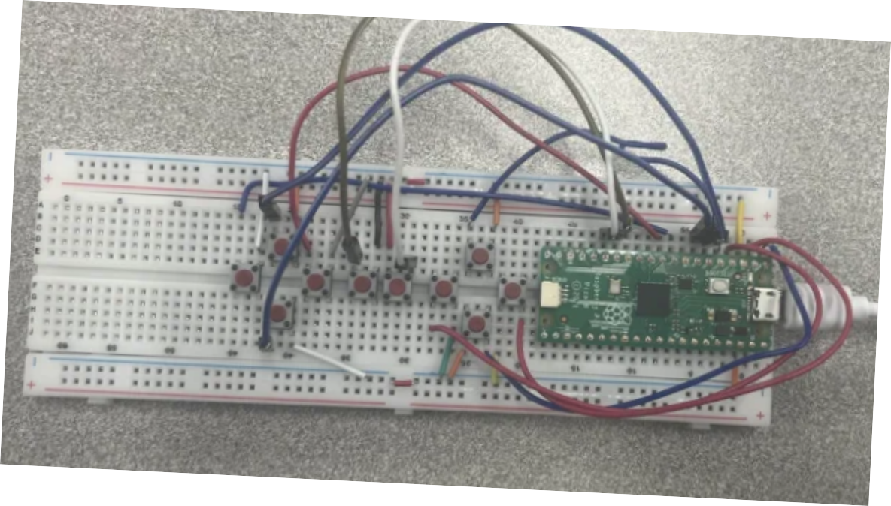
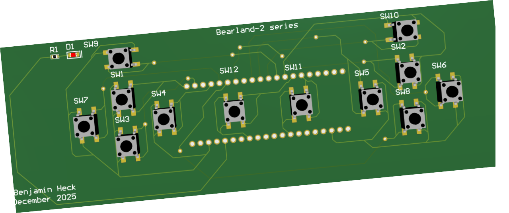
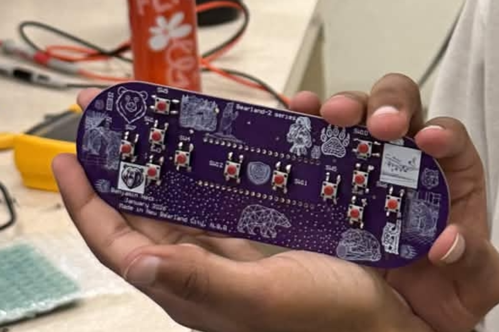

+++
title = "picoSNES"
+++

Team Three created a USB HID game controller inspired by an SNES controller.
The controller uses a Raspberry Pi Pico and 12 buttons to send standard gamepad
inputs over USB using the HID protocol, making it broadly compatible with
computers.

The team built an initial working prototype that reads button presses through
GPIO pins and converts them into USB gamepad inputs. They also created a
preliminary PCB layout/render and produced a finalized controller board design.
The Pico installation and soldering preparation were completed, though some
intended components, such as resistors and diodes, were not included due to time
and part limitations.

