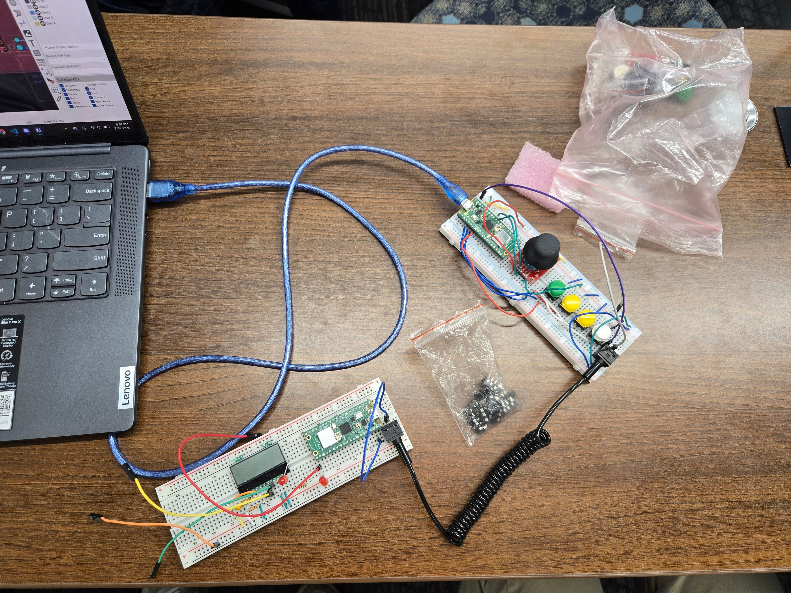
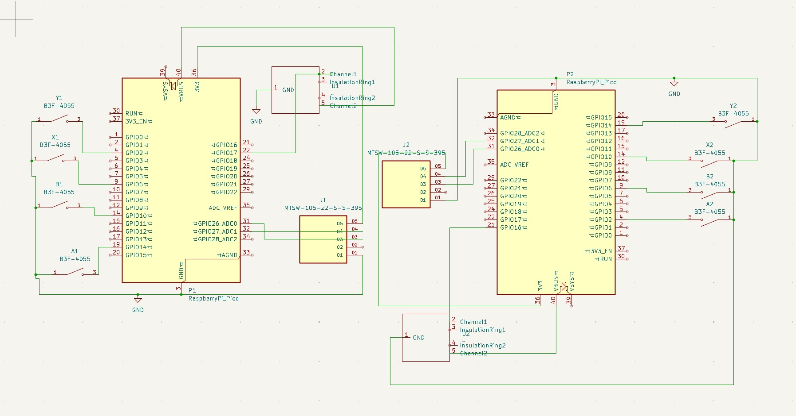

+++
title = "Two Piece Controller"
+++

Team Ten worked on a two-piece gaming controller designed to split into two
separate gamepads. Each gamepad includes buttons, a dual-axis joystick, and a
Raspberry Pi Pico 2 W. The two halves are intended to communicate using UART
through a TRS cable, which carries ground, power, and UART data.

The team completed the PCB design and built working button and joystick
functionality. They verified that each gamepad can read button inputs and
joystick X/Y inputs. They also made progress on the UART communication system,
but it still requires debugging. Their next step is to finish the casing that
will hold the PCB and complete the final controller assembly.

