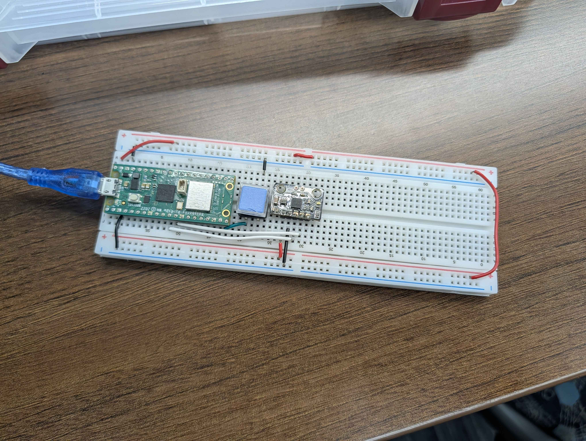

+++
title = "Wiimote"
+++

Team Wiimote proposed building a Wii Remote–inspired computer mouse using a
Raspberry Pi Pico. The design used motion controls for cursor movement, rear
buttons for left and right click, and an additional input for scrolling.

The team adopted existing HID firmware, then implemented button and joystick
controls and integrated physical input components. By the end of the project,
they successfully demonstrated a physical button functioning as a left mouse
click and established the foundation for the remaining controls.

